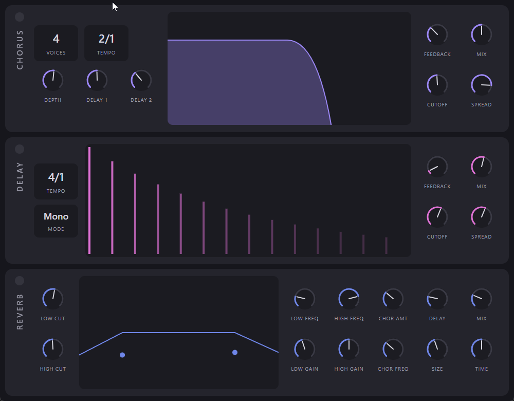

# Vial Effects

The chorus, delay, and reverb effects from the [vial](../vial) synthesiser,
extracted into a standalone audio effect plugin with an **entirely web-based UI**.

The DSP is vendored from vial unchanged, so the effects sound identical to the
synth. The user interface is a React app rendered in a JUCE 8
`WebBrowserComponent`, styled after vial's effects rack (three stacked panels:
Chorus, Delay, Reverb).



> **Status:** Builds and runs (VST3 + Standalone on Windows; AU on macOS). The
> DSP, plugin, WebView UI, and tests are all in place. See
> [CHANGELOG.md](CHANGELOG.md).
>
> Known issue: in the standalone, integer parameters (chorus voices, the tempo
> selectors) display their value differently than the dev/test build — the
> WebView relay reports `AudioParameterInt` values in a way the UI reads back as
> the minimum. Float controls are correct. Follow-up needed.

## Architecture

```text
audio in ─▶ Chorus ─▶ Delay ─▶ Reverb ─▶ audio out
                 ▲        ▲         ▲
            APVTS params (scaled to engine units, tempo-synced)
                 ▲
        WebView UI  ◀── relays/attachments ──▶  AudioProcessorValueTreeState
```

- **`src/dsp/vial/`** — DSP vendored from vial (`Reverb`, `Delay`, and the
  `poly_float` Processor framework they need). Grouped as `framework/`,
  `effects/`, `filters/`, `lookups/`, `common/`.
- **`src/dsp/`** — `Chorus`, `EffectsEngine`, and `EffectParameters.h`
  (the shared parameter table, mirroring vial's `synth_parameters.cpp`).
- **`src/plugin/`** — `VialEffectsProcessor` (APVTS, audio) and
  `VialEffectsEditor` (WebView, parameter relays).
- **`ui/`** — React + Vite front-end

## Building

Prerequisites: CMake ≥ 3.22, a C++17 toolchain (MSVC on Windows), Node 18+, and
the **WebView2 SDK** (Windows). JUCE 8 is cloned into `third_party/JUCE`.

```bash
# 1. Clone JUCE (one-time setup)
git clone --depth 1 https://github.com/juce-framework/JUCE.git third_party/JUCE

# 2. Build the web UI (produces ui/dist/index.html, embedded as binary data)
cd ui && npm install && npm run build && cd ..

# 3. Configure + build the plugin
#    Windows: run inside a VS dev shell. WebView2 NuGet must be extracted to
#    third_party/Microsoft.Web.WebView2.<version>/ (the subdirectory name
#    matters — JUCE's FindWebView2.cmake globs for it).
cmake -B build -G Ninja -DCMAKE_BUILD_TYPE=Release \
      -DJUCE_WEBVIEW2_PACKAGE_LOCATION=third_party
cmake --build build
```

On Windows the WebView2 NuGet package must be downloaded and extracted so that
a `Microsoft.Web.WebView2.<version>/` subdirectory exists under
`third_party/`. The CMake variable `JUCE_WEBVIEW2_PACKAGE_LOCATION` should
point to `third_party` (one level up). JUCE's `FindWebView2.cmake` searches for
`<JUCE_WEBVIEW2_PACKAGE_LOCATION>/*Microsoft.Web.WebView2*` to find the
package.

### Tests

```bash
ctest --test-dir build          # native DSP tests (also: build/.../VialEffectsTests.exe)
cd ui && npm test && npm run e2e # Vitest component tests + Playwright e2e/visual
```

## Windows Installer (.msi)

A [WiX Toolset](https://wixtoolset.org/) source file is included at
`installer/VialEffects.wxs`. The `.msi` is built automatically in CI. To build
it locally (requires WiX Toolset v3.14+):

```powershell
$WIX = "C:\Program Files (x86)\WiX Toolset v3.14\bin"

# Harvest the VST3 directory tree
& "$WIX\heat.exe" dir "build\VialEffects_artefacts\Release\VST3\Vial Effects.vst3" `
  -out build\installer\vst3.wxs -gg -sfrag -dr VST3DIR -cg VST3Components `
  -var var.VST3SourceDir -template fragment

# Compile
& "$WIX\candle.exe" -arch x64 -ext WixUIExtension `
  -dVST3SourceDir="build\VialEffects_artefacts\Release\VST3\Vial Effects.vst3" `
  installer\VialEffects.wxs build\installer\vst3.wxs -out build\installer\

# Link
& "$WIX\light.exe" -ext WixUIExtension -sval `
  build\installer\VialEffects.wixobj build\installer\vst3.wixobj `
  -out build\installer\VialEffects-0.1.0-win64.msi
```

The `.msi` installs:
- VST3 → `C:\Program Files\Common Files\VST3\Vial Effects.vst3`
- Standalone → `C:\Program Files\buchenberg\Vial Effects\`
- Start Menu shortcuts
- Full uninstall via Add/Remove Programs

### Installer features

- **Component selection** — VST3 plugin only, standalone only, or both.
- Installs VST3 to the system-wide VST3 folder.
- Installs the standalone to `Program Files\buchenberg\Vial Effects\` with
  Start Menu shortcuts.
- Full uninstall support via Add/Remove Programs.

## macOS Installer

A flat `.pkg` installer is built automatically by CI. To build it locally:

```bash
# After building the plugin:
mkdir -p pkg_root/Library/Audio/Plug-Ins/VST3
mkdir -p pkg_root/Library/Audio/Plug-Ins/Components
mkdir -p pkg_root/Applications

cp -R "build/VialEffects_artefacts/Release/VST3/Vial Effects.vst3" \
  "pkg_root/Library/Audio/Plug-Ins/VST3/"
cp -R "build/VialEffects_artefacts/Release/AU/Vial Effects.component" \
  "pkg_root/Library/Audio/Plug-Ins/Components/"
cp -R "build/VialEffects_artefacts/Release/Standalone/Vial Effects.app" \
  "pkg_root/Applications/"

pkgbuild --root pkg_root \
  --identifier com.buchenberg.vialeffects \
  --version "0.1.0" \
  --install-location / \
  build/installer/VialEffects-0.1.0-macOS.pkg
```

The `.pkg` installs:

- VST3 → `/Library/Audio/Plug-Ins/VST3/Vial Effects.vst3`
- AU → `/Library/Audio/Plug-Ins/Components/Vial Effects.component`
- Standalone → `/Applications/Vial Effects.app`

## CI/CD

When a pull request is merged to `main`, [GitHub Actions](.github/workflows/build-and-release.yml)
automatically:

1. **Bumps the version** based on the PR title using [Conventional Commits](https://www.conventionalcommits.org/):
   - `fix:` → patch (`0.1.0` → `0.1.1`)
   - `feat:` → minor (`0.1.0` → `0.2.0`)
   - `BREAKING CHANGE` or `!:` → major (`0.1.0` → `1.0.0`)
2. **Builds installers** for Windows, macOS, and Linux in parallel
3. **Creates a GitHub Release** with all three installers

Pull requests that are still open trigger build validation across all platforms
(the version bump and release steps are skipped).

| Platform | Installer |
|----------|-----------|
| Windows | `.msi` (WiX) |
| macOS | `.pkg` (pkgbuild) |
| Linux | `.tar.gz` |

## Linux

The Linux build is distributed as a `.tar.gz` containing the VST3 bundle
and standalone executable. Extract and place them manually:

```bash
tar -xzf VialEffects-0.1.0-Linux.tar.gz
cp -R "Vial Effects.vst3" ~/.vst3/
cp "Vial Effects" ~/.local/bin/
```

## Licence & attribution

Derived from vial, which is itself based on Matt Tytel's **Vital**. The vendored
DSP retains its original GPLv3 headers, so this project is distributed under the
**GNU General Public License v3** — see [LICENSE](LICENSE).
# test
